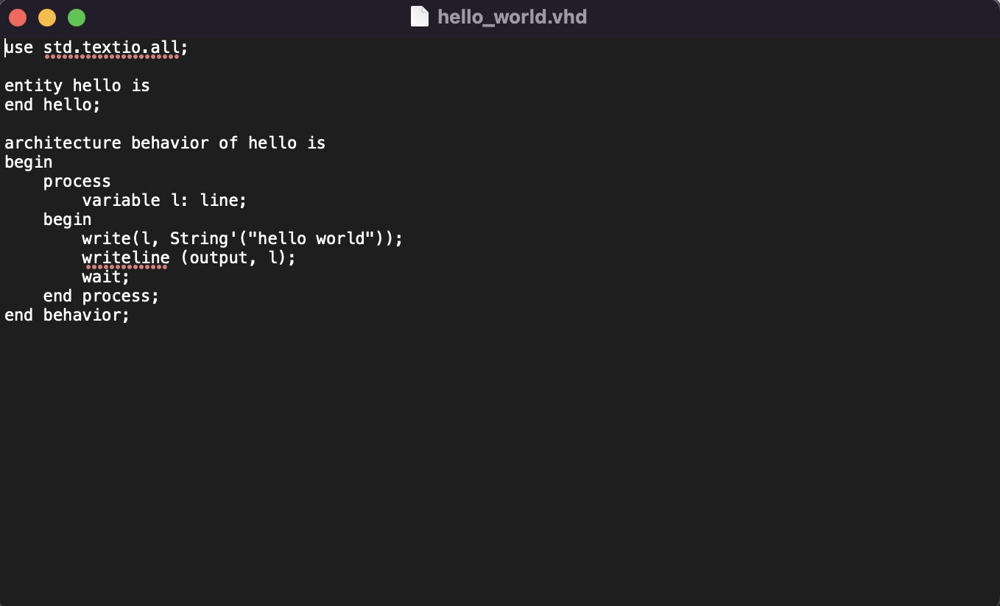
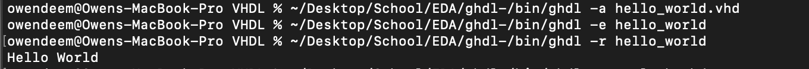
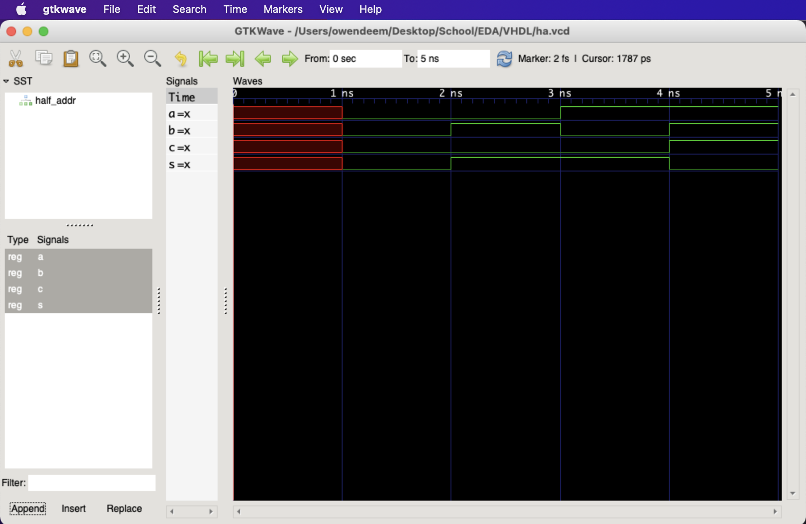
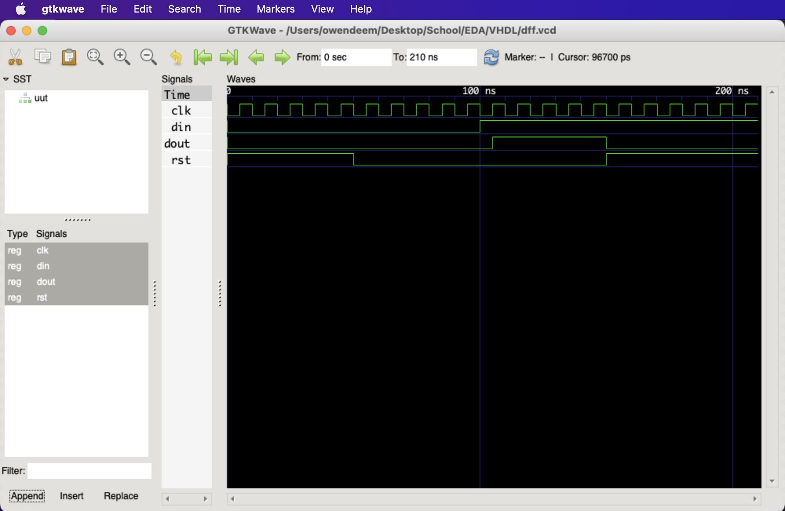

# Lab 1

Unfortunately, I don't have any documentation for downloading GHDL or GTKWave since I already had them from when I took Digital System Design.

Instead, I created a simple VHDL file to print Hello World: 

Here is the half-adder example running on GTKWave:

Similarly, this is the D-Flip-Flop example: 

