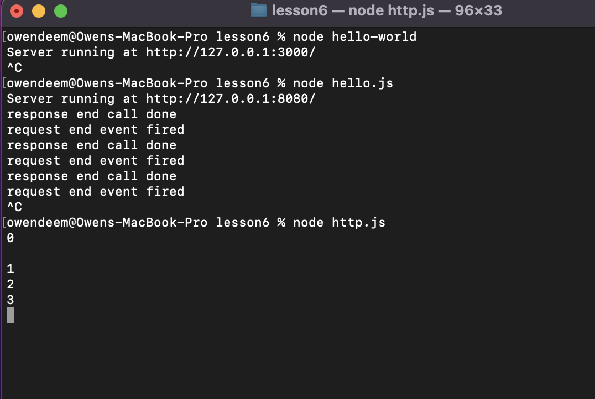
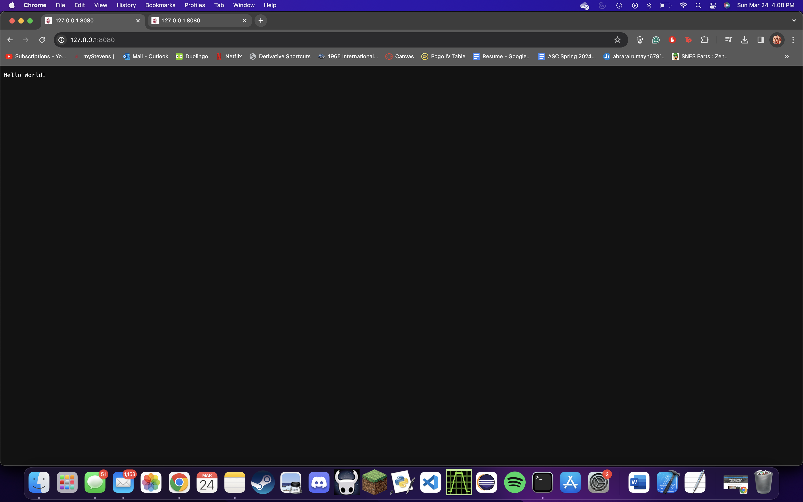
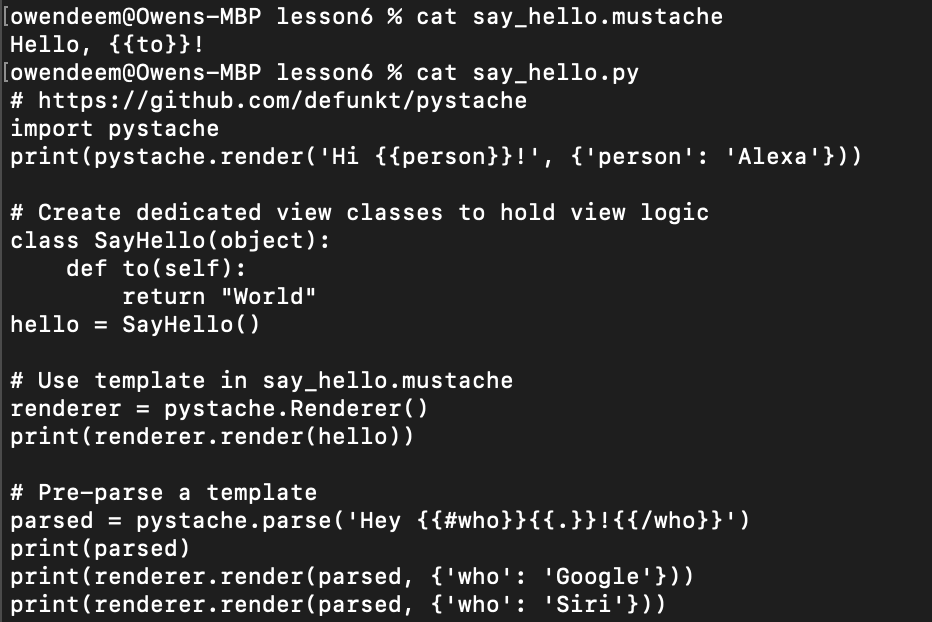
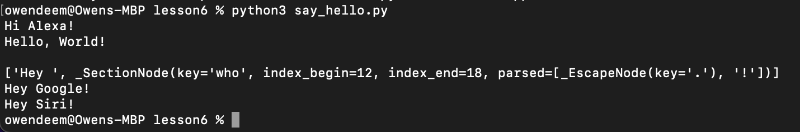

# Lab 6

I first had to install Node.js so I could run hello.js, hello-world.js, and http.js

The dates on my computer may look off. I did the first half of this lab a month ago and am just finishing it now.

For some reason when I tried installing Pystache with the sudo command, it couldn't be recognized. I re-installed it 
without sudo and it seemed to work just fine.

