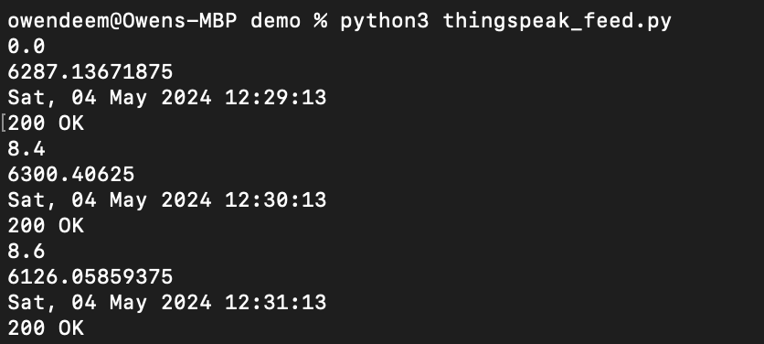
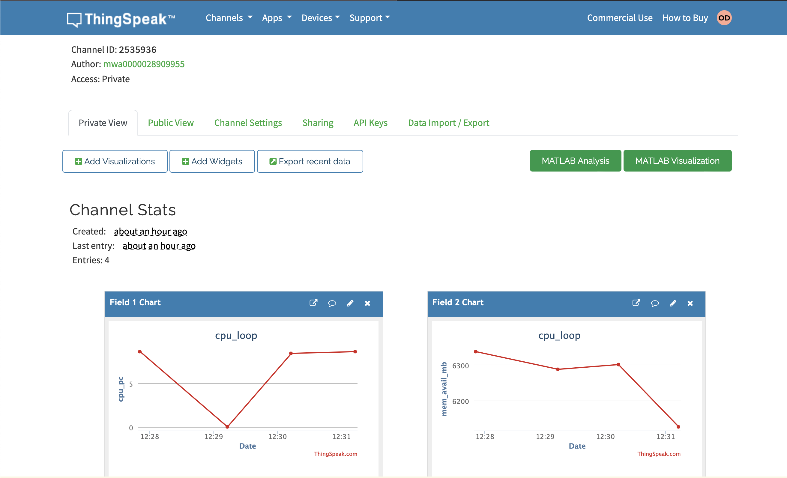
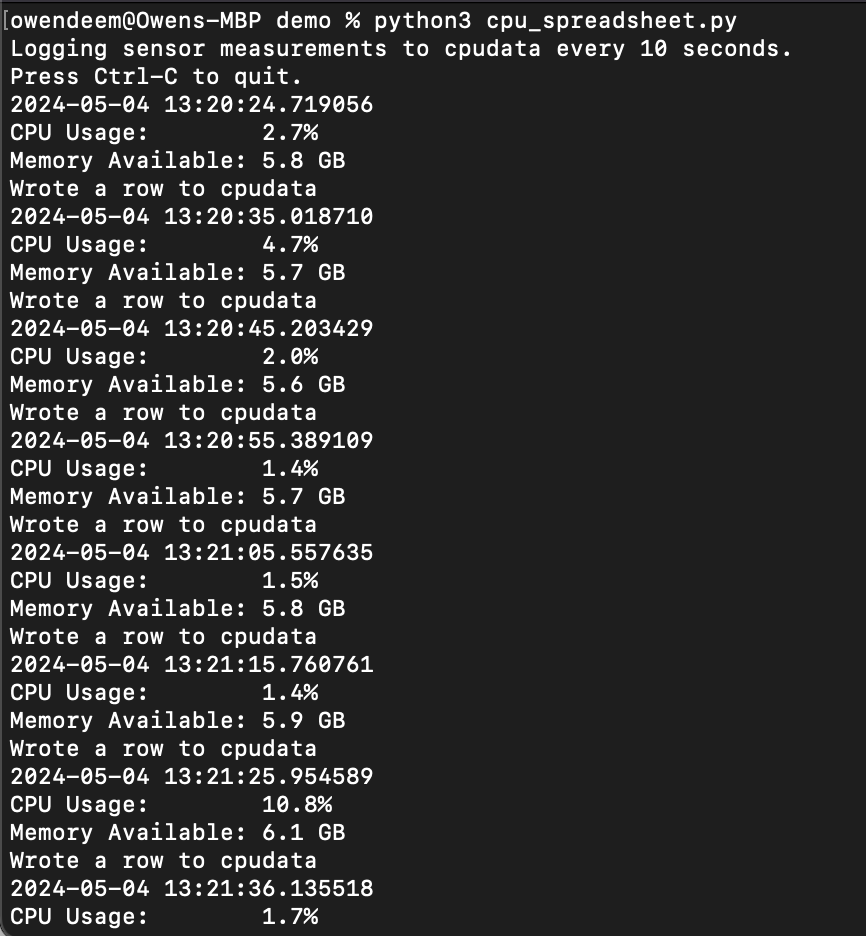
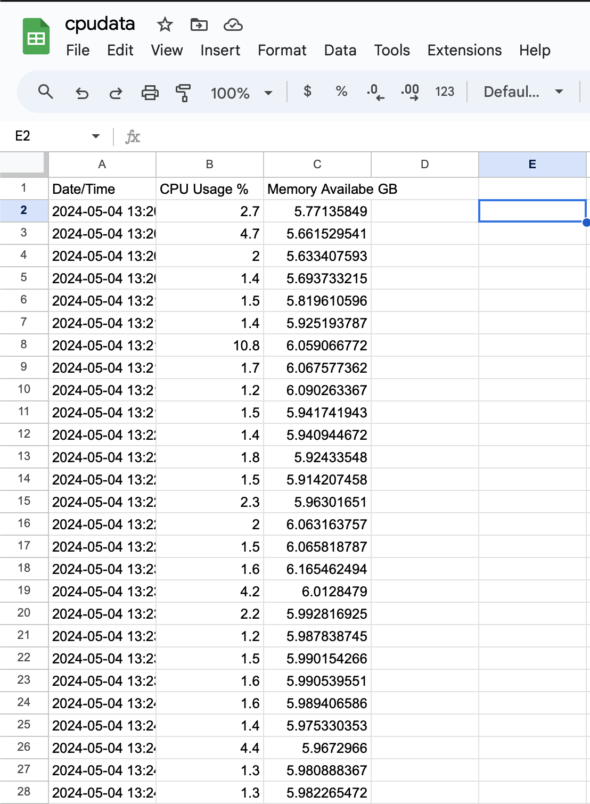

# Lab 7

Created a ThingSpeak account to track CPU data

Generating the API key to connect to Google Sheets was somewhat of a hassle
but I figured it out in the end

Here is some data that was sent to the sheet from my computer

