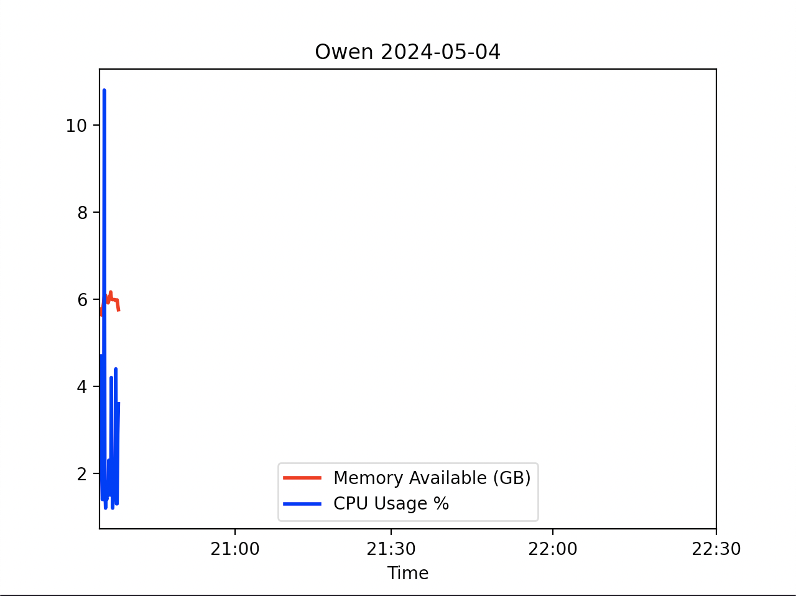

# Lab 8

I had to change both Python files to read "Memory Available GB" instead of "Temperature C"
because I did not record temperature data in lab 7.

I tried messing with the Python file, but I could not figure out how to get this plot to not 
look as compressed as it is.

