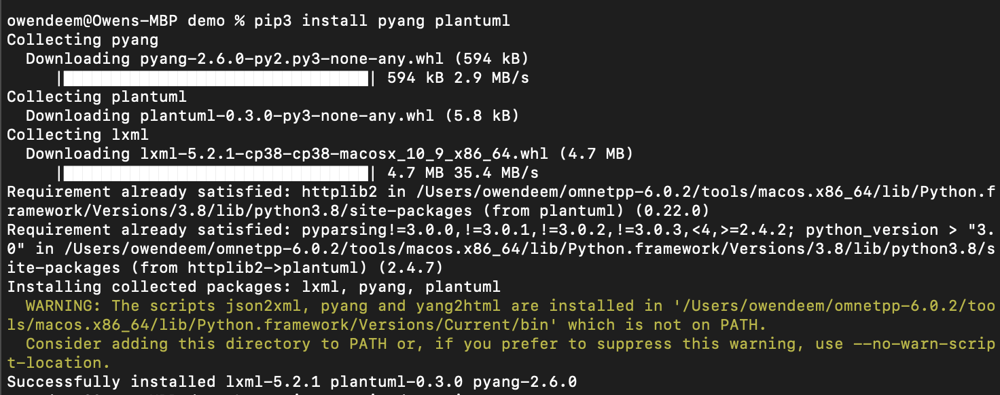

# Lab 9

I used the same demo folder as the previous labs instead of creating a new one.

I ran into some trouble trying to generate the .yin and .uml files. Pip downloaded
pyang into a random folder, so I had to find it and copy it to my PATH.

