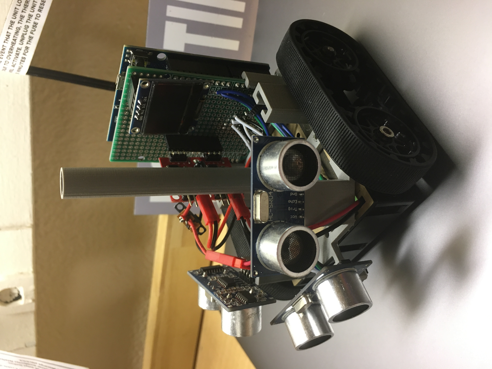

# Engineering Design VI
> "Engineering is the art of directing the great sources of power in nature for the use and convenience of man" - Thomas Tredgold

Semester: **Spring 2024** \
Instructor: **Dr. Kevin Lu**

## Course Description
*This course introduces students to critical engineering design topics such as needs assessment, problem formulation, modeling, patents, abstraction and synthesis, economic analysis, product liability, ergonomics, engineering ethics, hazards analysis, design for X, material selection, and manufacturing processes. Students learn that engineering is a service profession, dedicated to satisfying humanity's needs through responsible, methodical, and creative problem solving.* 

### Learning Outcomes
Upon completion of this course, students will be able to: 
- Formulate problems correctly
- Work successfully in interdisciplinary teams
- Develop creativity, imagination, and analytical skills
- Incorporate appropriate engineering standards and multiple constraints
- Apply the knowledge and skills acquired in earlier coursework
- Make informed ethical decisions
- Hone written and oral communication skills

## About Me
*I am a third-year student at Stevens Institute of Technology. I'm studying electrical engineering and computer science and plan to pursue a master's degree in electrical engineering after my career at Stevens.* \
\
[My Linkedin](https://www.linkedin.com/in/owen-deem-069a4a237/)
### Career Interests 
1. Embedded System Design
2. Quantum Computing
3. Communications

### Personal Interests
- Baseball
-  Skiing
- Backpacking
- Enjoying life!
---
Here's some code I wrote in Python to calculate the Mandelbrot set: 
```Python
def mult(c,n):
    '''multiplies c by n using for loop'''
    result = 0
    for num in range(n):
        result += c
    return result

def update(c,n):
    '''calculates the mandelbrot equation for number c to
        n degree of precision'''
    z = 0
    for num in range(n):
        z = z**2 + c
    return z
    

def inMSet(c,n):
    '''returns true if c is in the mandelbrot set, false if not'''
    z = 0
    for num in range(n):
        z = z**2 + c
        if abs(z) >= 2:
            return False
    return True
```
---
Here is a photo of the robot I built in Design I: 


